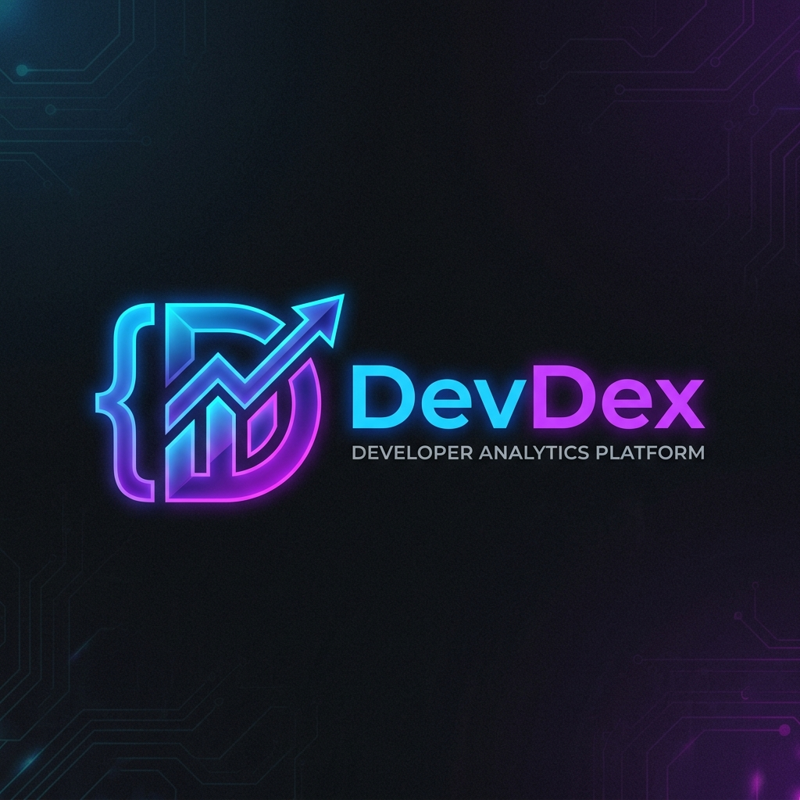

  
   
   
  
  
  
   
   
  <h1>🚀 DevDex</h1>
  <h3>Understand Developers. Instantly.</h3>
  
An AI-powered intelligence platform that analyzes GitHub profiles to generate tailored resumes, mock technical interviews, career timelines, and open-source matchmaking.

---

## 🌟 Overview

**DevDex** is a highly interactive, beautifully designed platform built to transform how developers showcase their skills and how recruiters find talent. Instead of manually reading through hundreds of repositories, simply enter a GitHub username. DevDex instantly aggregates their commit history, repository complexity, and language distribution, feeding it into a powerful LLM to generate deep, actionable insights.

## ✨ Features

- 📄 **AI Resume Builder:** Automatically generates a professional, recruiter-ready resume based on a developer's GitHub commits, pull requests, and top projects. Exportable to PDF.
- 

- 🤝 **OSS Matchmaker:** Acts as a Principal Tech Lead to recommend three active open-source projects perfectly tailored to the developer's tech stack and coding style.

- 

- 🎯 **Tailored Interview Generator:** Analyzes the developer's actual codebase to generate hyper-specific, brutal technical interview questions that they should know how to answer.

- 

- 📈 **Career Trajectory Timeline:** Uses historical commit data to plot the developer's growth from Junior to Senior, predicting their next career milestone.

- 

- 🩺 **Repo Health Scanner:** Scans public repositories to find code smells, security vulnerabilities, and architectural bottlenecks, providing actionable AI feedback.

- 

- ⚔️ **Battle Mode:** Pit two developers against each other in a fun, AI-judged comparison to see who has the cleaner code, better velocity, and higher impact.

- 

- 👥 **Squad Mode:** Build the ultimate engineering team by adding multiple developers and letting AI assign them roles (e.g., Tech Lead, DevOps, Frontend Developer).

- 

- 🔥 **GitHub Wrapped:** A vibrant, Spotify-style year-in-review that playfully explains a developer's coding habits, most used languages, and work-life balance.

- 

- DashBoard Photo:
- 

## 🛠️ Tech Stack

### Frontend
- **Framework:** [Next.js 14](https://nextjs.org/) (App Router)
- **Styling:** [Tailwind CSS](https://tailwindcss.com/)
- **Animations:** [Framer Motion](https://www.framer.com/motion/)
- **Charts:** [Recharts](https://recharts.org/) & React GitHub Calendar
- **Icons:** [Lucide React](https://lucide.dev/)

### Backend
- **Framework:** [FastAPI](https://fastapi.tiangolo.com/) (Python)
- **AI/LLM:** [Groq](https://groq.com/) (LLaMA 3.1 8B Instant)
- **Database / Cache:** [Supabase](https://supabase.com/) (PostgreSQL)
- **APIs:** GitHub REST API

## 🎨 Design Philosophy
DevDex was designed with a "dark mode by default" philosophy, utilizing heavy glassmorphism, vibrant neon accents, and smooth micro-animations. It feels premium, responsive, and alive, treating the developer's data with the respect it deserves.

## 📝 Copyright
&copy; 2026 Prashanth. All Rights Reserved. 

This is a closed-source personal project. Unauthorized copying, distribution, or modification of this repository is strictly prohibited.
